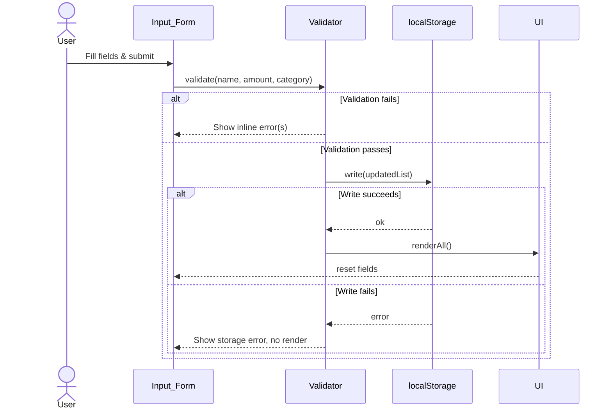
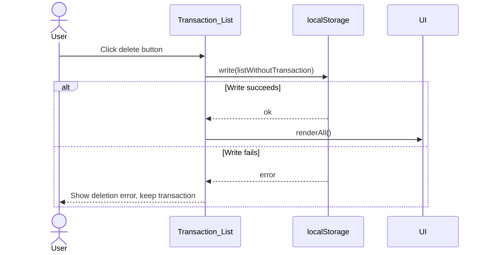

# Design Document: Expense & Budget Visualizer

## Overview

The Expense & Budget Visualizer is a single-page, client-side web application built with plain HTML, CSS, and vanilla JavaScript. It lets users record personal expense transactions, categorize them, view a running total, and visualize spending distribution via a Chart.js pie chart — all without a backend server or build tooling.

All state is stored in `localStorage` under a single key. The page is fully self-contained: one `.html` file, one `.css` file, and one `.js` file. Chart.js is loaded from a CDN. The app must work on viewport widths from 320 px to 1920 px across Chrome, Firefox, Edge, and Safari.

### Key Design Decisions

| Decision | Rationale |
|---|---|
| Single HTML page, no SPA router | Matches the "no build tools, no frameworks" constraint; reduces complexity |
| Module-pattern JS (IIFE) | Avoids global namespace pollution without requiring ES modules or a bundler |
| `localStorage` with JSON serialization | Only persistence option available in a pure browser environment; survives page reload |
| Chart.js via CDN (pie chart) | Requirement-mandated; avoids shipping a charting library as a file |
| Write-then-render persistence order | Ensures UI only reflects data that has been successfully persisted (Req 5.2, 5.3) |
| Responsive layout via CSS Grid + media queries | No framework CSS dependency; three-breakpoint grid covers 320–1920 px |

---

## Architecture

The application follows a **unidirectional data flow** pattern:

```
User Action
    │
    ▼
Event Handler (app.js)
    │
    ├─► State Mutation  ─► localStorage.setItem()
    │         │
    │         ▼
    └─► UI Render Functions
              ├─► renderTransactionList()
              ├─► renderBalanceDisplay()
              └─► renderChart()
```

There is no separate store object — the canonical state is always the array of transactions held in memory and mirrored to `localStorage`. All render functions are pure reads from that array.

### Module Breakdown

```
index.html       ← markup skeleton, CDN <script> for Chart.js, links app.css + app.js
app.css          ← layout, typography, responsive breakpoints, component styles
app.js           ← all application logic (IIFE)
  ├── storage    ← localStorage read/write/error-handling
  ├── state      ← in-memory transactions array, derived totals
  ├── validator  ← form field validation rules
  ├── ui         ← DOM render functions (list, balance, chart)
  └── events     ← form submit + delete button listeners
```

### Sequence: Add Transaction



### Sequence: Delete Transaction



---

## Components and Interfaces

### 1. `storage` module

```js
storage.load()   → Transaction[] | null
// Reads STORAGE_KEY from localStorage, JSON.parses, returns array or null on error.

storage.save(transactions: Transaction[])   → boolean
// JSON.stringifies and writes to STORAGE_KEY. Returns true on success, false on failure.
```

**Error handling**: Wraps every `localStorage` call in try/catch. Returns `null`/`false` on failure; never throws.

---

### 2. `validator` module

```js
validator.validateForm(name: string, amount: string, category: string)
  → { valid: boolean, errors: { name?: string, amount?: string, category?: string } }
```

Rules:
- `name`: non-empty after trim, max 100 chars
- `amount`: must parse as a finite number, must be in range [0.01, 999,999,999.99]
- `category`: must be one of `["Food", "Transport", "Fun"]`

---

### 3. `state` module

```js
state.transactions  : Transaction[]          // in-memory array, reverse-chron on read

state.add(t: Transaction)    → void          // prepend, save, renderAll
state.remove(id: string)     → void          // filter out, save, renderAll
state.load()                 → void          // called on init; loads from storage
state.totals()               → CategoryTotals
state.balance()              → number
```

---

### 4. UI render functions

```js
ui.renderTransactionList(transactions: Transaction[])  → void
// Re-builds the <ul> DOM. Shows empty-state message when array is empty.

ui.renderBalanceDisplay(balance: number)               → void
// Writes formatted currency string to the balance element.

ui.renderChart(totals: CategoryTotals, chart: ChartInstance | null) → ChartInstance
// Creates or updates the Chart.js pie chart. Shows placeholder text when totals are all zero.
```

---

### 5. `events` module

- Attaches `submit` listener to `#transaction-form`
- Uses event delegation on `#transaction-list` for delete buttons (handles dynamically added rows)

---

### HTML Structure (skeleton)

```html
<main class="app-grid">
  <section class="card form-section">
    <h2>Add Expense</h2>
    <form id="transaction-form">
      <div class="field">
        <label for="item-name">Item</label>
        <input id="item-name" type="text" maxlength="100" required>
        <span class="error" id="err-name" aria-live="polite"></span>
      </div>
      <div class="field">
        <label for="amount">Amount</label>
        <input id="amount" type="number" step="0.01" min="0.01" required>
        <span class="error" id="err-amount" aria-live="polite"></span>
      </div>
      <div class="field">
        <label for="category">Category</label>
        <select id="category" required>
          <option value="">-- Select --</option>
          <option value="Food">Food</option>
          <option value="Transport">Transport</option>
          <option value="Fun">Fun</option>
        </select>
        <span class="error" id="err-category" aria-live="polite"></span>
      </div>
      <button type="submit">Add Expense</button>
    </form>
  </section>

  <section class="card balance-section">
    <h2>Total Spending</h2>
    <p id="balance-display">$0.00</p>
  </section>

  <section class="card chart-section">
    <h2>Spending by Category</h2>
    <div id="chart-container">
      <canvas id="spending-chart"></canvas>
      <p id="chart-placeholder" hidden>No data available.</p>
    </div>
  </section>

  <section class="card list-section">
    <h2>Transactions</h2>
    <ul id="transaction-list" aria-label="Transaction history"></ul>
  </section>
</main>
```

---

## Data Models

### `Transaction`

```js
/**
 * @typedef {Object} Transaction
 * @property {string}  id        - UUID v4 (crypto.randomUUID or fallback)
 * @property {string}  name      - Item name, 1–100 chars (trimmed)
 * @property {number}  amount    - Positive number, 0.01–999999999.99
 * @property {string}  category  - "Food" | "Transport" | "Fun"
 * @property {string}  createdAt - ISO 8601 timestamp (Date.toISOString())
 */
```

### `CategoryTotals`

```js
/**
 * @typedef {Object} CategoryTotals
 * @property {number} Food
 * @property {number} Transport
 * @property {number} Fun
 */
```

### `localStorage` Schema

```
Key:   "expense_visualizer_v1"
Value: JSON string of Transaction[]

Example:
[
  {
    "id": "f47ac10b-58cc-4372-a567-0e02b2c3d479",
    "name": "Lunch",
    "amount": 12.50,
    "category": "Food",
    "createdAt": "2025-07-20T08:30:00.000Z"
  }
]
```

The version suffix `_v1` in the key allows future schema migrations to use a new key without corrupting old data.

### ID Generation

`crypto.randomUUID()` is available in all target browsers (Chrome 92+, Firefox 95+, Edge 92+, Safari 15.4+). A `Date.now() + Math.random()` fallback is provided for any edge-case browser environments.

### Currency Formatting

```js
const formatCurrency = (amount) =>
  new Intl.NumberFormat('en-US', { style: 'currency', currency: 'USD' }).format(amount);
// Output: "$12.50", "$1,234.56"
```

`Intl.NumberFormat` is supported in all target browsers; no polyfill needed.

---

## Correctness Properties

*A property is a characteristic or behavior that should hold true across all valid executions of a system — essentially, a formal statement about what the system should do. Properties serve as the bridge between human-readable specifications and machine-verifiable correctness guarantees.*

### Property 1: Valid transaction is added to the list

*For any* valid transaction (non-empty name ≤ 100 chars, amount in [0.01, 999999999.99], category in {Food, Transport, Fun}), after calling `state.add()`, the transaction list length SHALL increase by exactly 1 and the new transaction SHALL appear as the first element.

**Validates: Requirements 1.2, 2.1**

---

### Property 2: Whitespace-only or empty names are rejected

*For any* string composed entirely of whitespace characters (including the empty string), the validator SHALL classify it as invalid for the name field and SHALL NOT add a transaction.

**Validates: Requirements 1.3**

---

### Property 3: Out-of-range or non-numeric amounts are rejected

*For any* amount value that is non-numeric, non-positive, less than 0.01, or greater than 999,999,999.99, the validator SHALL classify it as invalid and SHALL NOT add a transaction.

**Validates: Requirements 1.4**

---

### Property 4: Balance equals sum of all transaction amounts

*For any* list of transactions, the value returned by `state.balance()` SHALL equal the arithmetic sum of all transaction amounts in that list, formatted to 2 decimal places.

**Validates: Requirements 3.1, 3.2, 3.3**

---

### Property 5: Delete removes exactly one transaction and preserves the rest

*For any* non-empty transaction list and any transaction in that list, after calling `state.remove(id)`, the resulting list SHALL have exactly one fewer element, the removed transaction SHALL NOT appear in the list, and all other transactions SHALL remain unchanged.

**Validates: Requirements 2.3**

---

### Property 6: localStorage round-trip preserves transaction data

*For any* array of valid transactions, serializing via `storage.save()` and then deserializing via `storage.load()` SHALL produce an array that is deeply equal to the original (same ids, names, amounts, categories, timestamps, same order).

**Validates: Requirements 5.1, 5.2, 5.3, 5.6**

---

### Property 7: Category totals are consistent with transaction list

*For any* list of transactions, the `state.totals()` result SHALL have each category's value equal to the sum of amounts of all transactions in that category, and the sum of all category totals SHALL equal `state.balance()`.

**Validates: Requirements 4.1, 4.2**

---

### Property 8: Form reset clears all fields after successful add

*For any* successfully submitted transaction, after the add completes, the item name field SHALL be empty, the amount field SHALL be empty, and the category dropdown SHALL show the default unselected option.

**Validates: Requirements 1.5**

---

## Error Handling

### Error Surface Map

| Scenario | Trigger | User-Facing Response | Code Behavior |
|---|---|---|---|
| Missing form field(s) | Submit with empty field | Inline error per field (`aria-live`) | Validator returns errors; no transaction added |
| Invalid amount | Non-numeric, ≤ 0, > 999M | Inline error on amount field | Validator returns error; no transaction added |
| `localStorage` unavailable on load | `localStorage` throws on init | Non-blocking banner: "Saved data could not be loaded" | App starts with empty list |
| `localStorage` write fails (add) | `storage.save()` returns false | Non-blocking banner: "Transaction could not be saved" | No list/chart/balance update |
| `localStorage` write fails (delete) | `storage.save()` returns false | Non-blocking banner: "Deletion could not be completed" | Transaction stays in list |
| `localStorage` parse error on load | Corrupt stored JSON | Non-blocking banner: "Saved data could not be loaded" | App starts with empty list |
| Browser lacks `localStorage` | Feature detection on init | Non-blocking banner: "LocalStorage is unavailable; data will not persist" | App runs in-memory only |
| Chart.js CDN fails to load | `window.Chart` undefined | In-place message: "Chart unavailable" | Balance and list still function |

### Error Display Rules

- **Inline validation errors** appear below the relevant form field and are cleared on next valid submission.
- **Non-blocking banners** appear at the top of the page, auto-dismiss after 5 s, and can be closed manually.
- No error blocks the user from interacting with parts of the app that still work.
- All error messages use `aria-live="polite"` or `role="alert"` for screen reader accessibility.

---

## Testing Strategy

### Unit Tests (example-based)

Focus on concrete behavior and edge cases. Use a minimal test harness (e.g., plain `assert` calls or a micro-library like `uvu`) — no framework required, matching the no-build-tooling constraint.

| Area | What to test |
|---|---|
| `validator.validateForm` | Empty name, whitespace-only name, name > 100 chars, amount = 0, amount < 0, amount = 0.01 (valid boundary), amount = 999999999.99 (valid boundary), amount = 1000000000 (invalid), non-numeric amount, invalid category string |
| `storage.load` | Returns `[]` when key is absent, returns parsed array when valid JSON is stored, returns `null` on corrupt JSON |
| `storage.save` | Returns `true` on success, returns `false` when `localStorage.setItem` throws |
| `state.totals` | Correct sum per category across mixed transactions; zero totals for empty list |
| `state.balance` | Correct sum; $0.00 for empty list |
| `formatCurrency` | $0.00, $12.50, $1,234.56, $999,999,999.99 |
| `renderTransactionList` | Empty-state message shown when list is empty; most recent transaction appears first |

### Property-Based Tests

Use [fast-check](https://github.com/dubzzz/fast-check) (loaded via CDN or npm in a test environment). Each test runs a minimum of **100 iterations**.

Each test is tagged: **Feature: expense-budget-visualizer, Property {N}: {property text}**

| Property | Generator strategy |
|---|---|
| P1: Valid transaction grows list by 1 | `fc.record({ name: fc.string({minLength:1,maxLength:100}).filter(s=>s.trim().length>0), amount: fc.float({min:0.01,max:999999999.99}), category: fc.constantFrom('Food','Transport','Fun') })` |
| P2: Whitespace names rejected | `fc.string().map(s => s.replace(/\S/g,''))` — produces whitespace-only strings |
| P3: Out-of-range amounts rejected | `fc.oneof(fc.constant(0), fc.float({max:-0.001}), fc.constant(1e10), fc.string())` |
| P4: Balance = sum of amounts | `fc.array(validTransactionArb)` |
| P5: Delete preserves rest | `fc.array(validTransactionArb, {minLength:1})` + `fc.nat()` to pick index |
| P6: localStorage round-trip | `fc.array(validTransactionArb)` |
| P7: Category totals consistent | `fc.array(validTransactionArb)` |
| P8: Form reset after add | `validTransactionArb` |

### Integration / Manual Smoke Tests

These verify browser environment behavior that cannot be covered by property-based tests:

1. **Load from storage**: Reload page → transactions, balance, and chart all match pre-reload state.
2. **Storage unavailable**: Disable `localStorage` via DevTools → non-blocking warning appears; add/delete do not crash.
3. **Chart.js CDN**: Block CDN request in DevTools → "Chart unavailable" message shown; rest of app functions.
4. **Responsive layout**: Verify at 320 px, 768 px, 1024 px, and 1920 px viewport widths → no layout breakage.
5. **Cross-browser**: Smoke test all CRUD operations in Chrome, Firefox, Edge, Safari.
6. **Performance**: Measure time-to-interactive on a throttled 25 Mbps connection → under 3 s.
